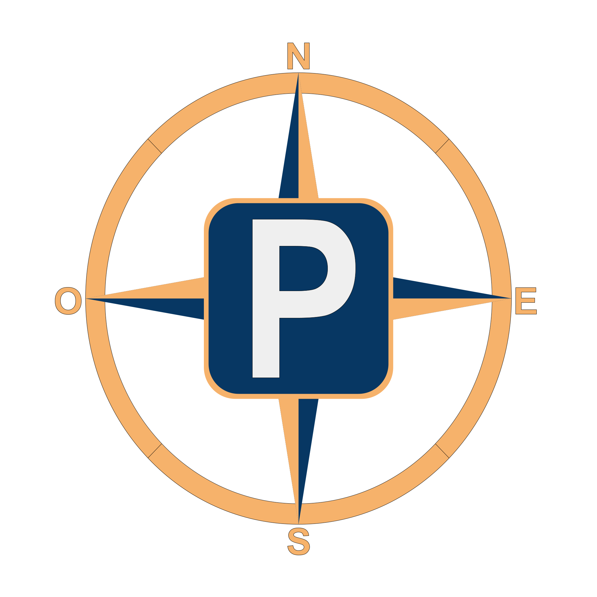
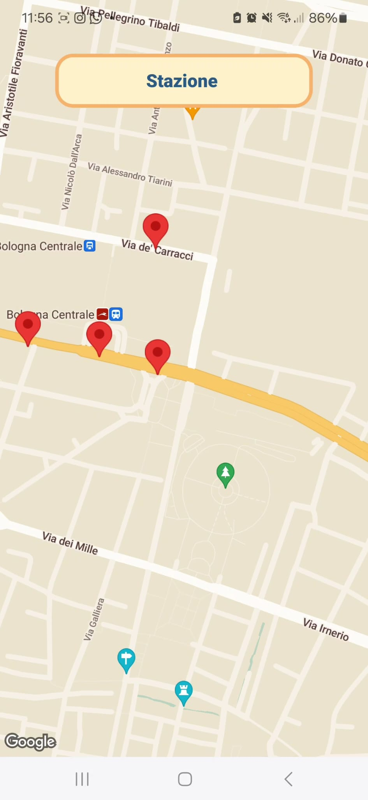
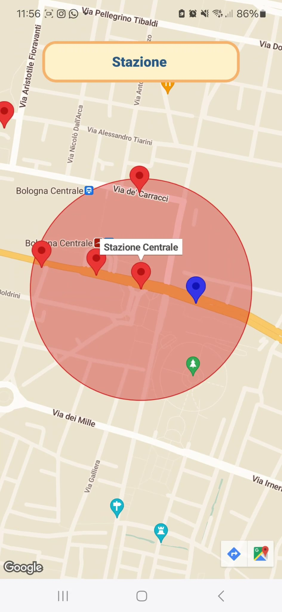
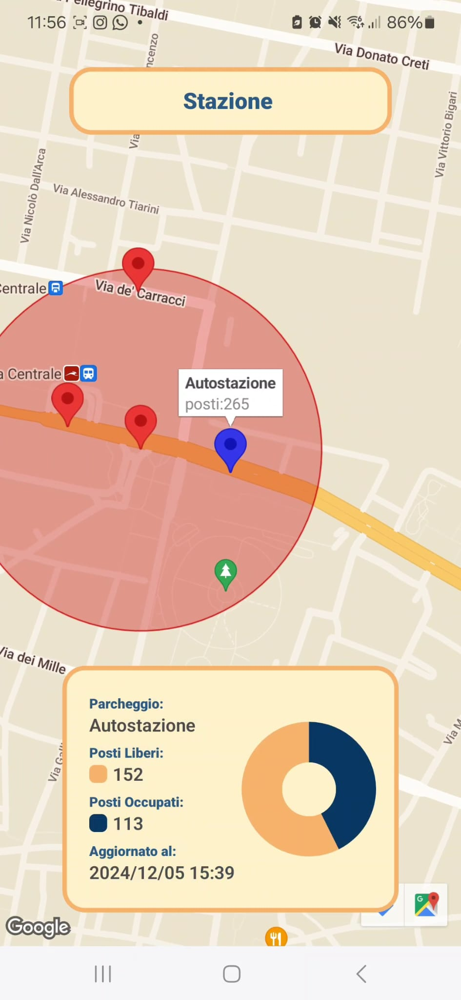
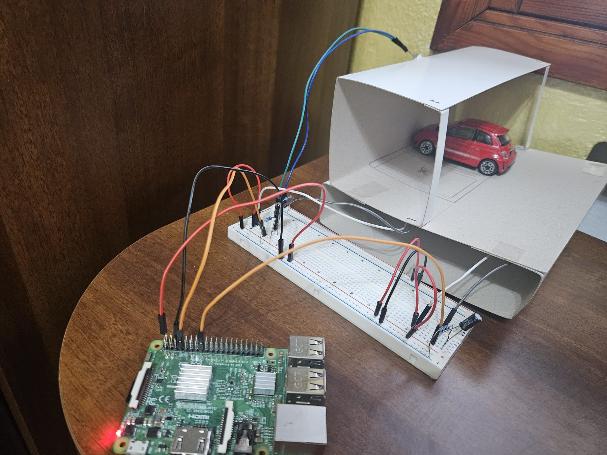

# ParKompass



## Intro

ParKompass is a cross-platform distributed application designed to assist you in finding parking spots in your city. It offers a user-friendly Interface displaying a list of parking lots near your chosen point of interest along with their latest occupancy status. One of the key features of ParKompass is its adaptability, as it can gather parking lot occupancy data from various sources. To demonstrate this capability, we have developed a prototype that supports three different types of data sources:

- **Open Database**: Utilizes data shared by the Municipality of Bologna as part of the OpenData project.

- **Light Sensors**: Uses individual sensors to measure the occupancy of single parking spots.

- **Camera Sensors**: Employs computer vision techniques to detect available spots from images.

## Development

ParKompass development is divided into three main parts:

### Frontend

The frontend is a React Native application with the following functionalities:

1. **Location Search**: Upon entering the app, the user is prompted to search for a location. The search is handled by querying the [OpenRouteService](https://openrouteservice.org/) API, which returns a list of coordinates displayed as red markers on a map.
   <br/>
    

2. **Parking Lot Display**: Clicking on a red marker sends a query to the ParKompass backend, resulting in a new set of blue markers appearing. Each blue marker represents a parking lot within a 300-meter radius of the selected location.
   <br/>
    

3. **Parking Lot Information**: Clicking on a blue marker displays information about the corresponding parking lot, including its full name, occupation, and the timestamp of the last measurement.
   <br/>
    

### Backend

The backend consist of Node server exposing mainly two REST APIs:

- **[GET] /api/parkingLots**: this API is used by the frontend to retrieve a list of parking lots within a specified boundary. The following query parameters must be provided:

  - `boundary.center.latitude` (string): The latitude of the center of the boundary.
  - `boundary.center.longitude` (string): The longitude of the center of the boundary.
  - `boundary.radius` (string): The radius of the boundary in meters.
  - `maxResults` (string): The maximum number of parking lots to return.

  It returns a JSON answer containg a list of ParkingLots, where each ParkingLot has the following format:

  ```ts
  type ParkingLot = {
    id: number;
    name: string;
    updateDateTime: number;
    totalParkings: number;
    availableParkings: number;
    occupiedParkings: number;
    coordinate: Coordinate;
  };

  type Coordinate = {
    latitude: number;
    longitude: number;
  };
  ```

- **[PUT] /api/parkingLots**: this API is used by sensors and adapters to update the info about a parking lot. The following query parameters must be provided:

  - `id` (string): The id of the parking lot to update.

  The request body must contain the ParkingLot updated info in the following JSON format:

  ```ts
  type ParkingLot = {
    id: number;
    name: string;
    updateDateTime: number;
    totalParkings: number;
    availableParkings: number;
    occupiedParkings: number;
    coordinate: Coordinate;
  };
  type Coordinate = {
    latitude: number;
    longitude: number;
  };
  ```

### Sensors and Adapters

To showcase the versatility of ParKompass, we have developed three distinct data sources for parking lot occupancy:

- **Open Data Adapter**: A Node application that periodically retrieves occupancy data from three open databases maintained by the Municipality of Bologna.

- **Light Sensor**: A miniature parking lot model with two spots, each equipped with a photoresistor. The data is managed by a Raspberry Pi, which sends the occupancy information to the ParKompass backend.<br/>


- **Camera Sensor**: Another miniature parking lot model with six spots, utilizing computer vision techniques to determine occupancy. The data is processed by a Raspberry Pi equipped with a camera.


## Credits

ParKompass has been developed by:

- [b3nny01](https://github.com/b3nny01)
- [jjulespop](https://github.com/jjulespop)
- [dagus01-lab](https://github.com/dagus01-lab)
- [Emanuele8](https://github.com/Emanuele8)
- [bryanber102](https://github.com/bryanber102)
