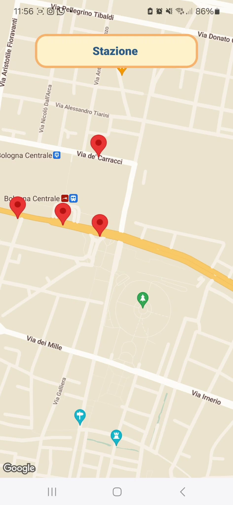

# ParKING frontend
App that helps users find available parking slots in the city centre.
## Deployment
### Prerequisites
1. Ensure you have [Node.js](https://nodejs.org/) installed and up-to-date.
2. Install dependencies: ```npm install```
### Run the app
The app is deployed using the expo framework. It is hence possible to build it on different platforms: 
- for android, run: npm run android
- for web, run: npm run web
- for ios, run: npm run ios
## Structure
The app provides the following functionalities:

1. **Location Search**: Upon entering the app, the user is prompted to search for a location. The search is handled by querying the [OpenRouteService](https://openrouteservice.org/) API, which returns a list of coordinates displayed as red markers on a map.
   <br/>
    

2. **Parking Lot Display**: Clicking on a red marker sends a query to the ParKompass backend, resulting in a new set of blue markers appearing. Each blue marker represents a parking lot within a 300-meter radius of the selected location.
   <br/>
    

3. **Parking Lot Information**: Clicking on a blue marker displays information about the corresponding parking lot, including its full name, occupation, and the timestamp of the last measurement.
   <br/>
    