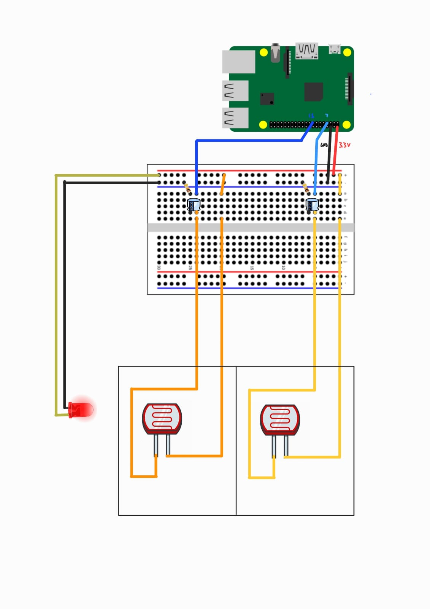
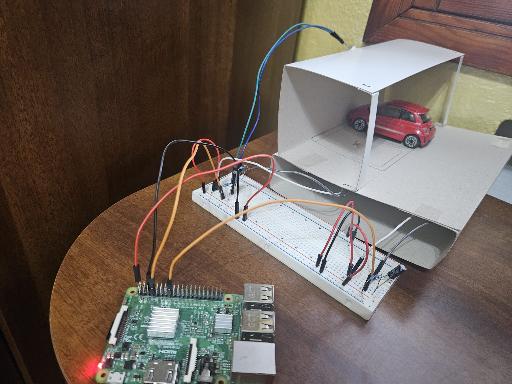

# Parking Spot Detection with Photoresistors

This section of the repository describes how we used photoresistors to detect parking availability.

Unfortunately, we only had Raspberry Pi boards (which do not have analog pins), so we had to use a workaround to read values from photoresistors (which output analog signals). We plan to refactor this part to support devices with analog pins, such as the ESP32 or Arduino.

## Hardware Requirements

- Raspberry Pi 3 (or any model with GPIO pins)
- 2 Photoresistors (LDR)
- 2 Capacitors (e.g., 100nF or 10uF)
- 2 Resistors (e.g., 10kΩ)
- Raspberry Pi (with GPIO pins)
- Breadboard and jumper wires

### Circuit Setup

1. Voltage Divider: Use the photoresistor in series with a resistor to create a voltage divider. This will produce a varying voltage based on the light level, which will change the charge/discharge time of the capacitor.

2. Capacitor: The capacitor will charge or discharge depending on the voltage across it. The charging/discharging time will vary based on the light level detected by the photoresistor.

3. GPIO Pin for Timing: Use a GPIO pin to measure the time it takes for the capacitor to charge or discharge through the photoresistor and resistor. You can measure the time it takes to reach a certain voltage threshold (for example, 3.3V).

#### Wiring Diagram


Here is an illustration of the demo setup:



## Software Requirements
Install the RPi.GPIO library:

    ```sudo apt-get install python3-rpi.gpio```

## Run the app

Run the python script for the parking spot detection:

    ```python parking_detection.py```