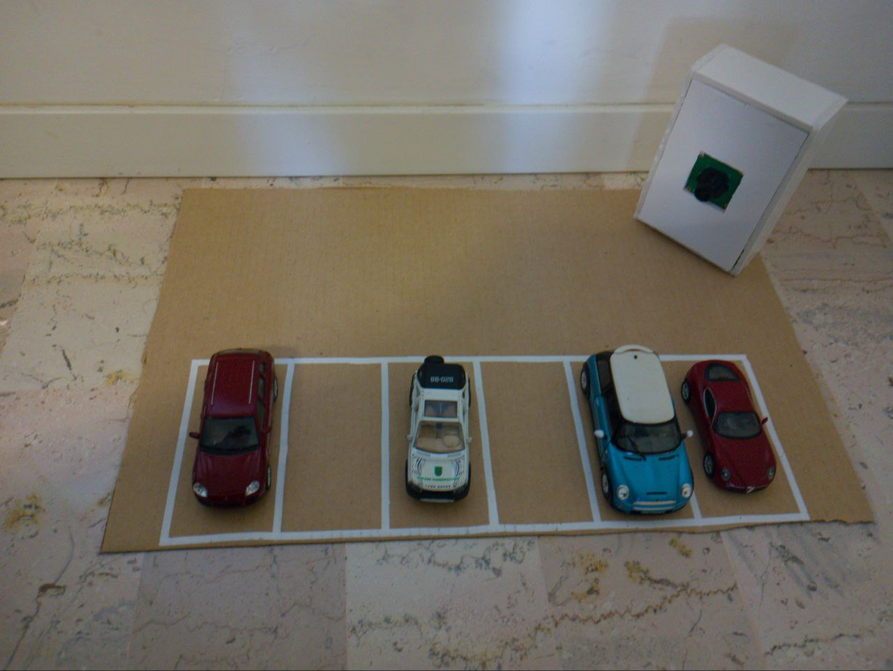
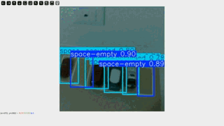

# Parking Detection Camera
This part of the repository contains the code to train a model to detect free parkings from a given image, and the inference code for a raspberry pi.
## The model
### Original Dataset
The dataset used for training was created by combining several publicly available datasets:
- [Roboflow Parking Datasets](https://universe.roboflow.com/browse/transportation/parking)
- [UFPR Parking Lot Database](https://web.inf.ufpr.br/vri/databases/parking-lot-database/)
### Result
The model was fine-tuned using YOLOv11. Below are the training results:
```
YOLO11n summary (fused): 238 layers, 2,582,542 parameters, 0 gradients, 6.3 GFLOPs
                 Class     Images  Instances      Box(P          R      mAP50  mAP50-95): 100%|██████████| 19/19 [00:25<00:00,  1.35s/it]
                   all       4623     266365      0.998      0.996      0.995      0.959
           space-empty       3944     139864      0.998      0.996      0.995      0.964
        space-occupied       3682     126501      0.998      0.997      0.995      0.953
Speed: 0.0ms preprocess, 0.4ms inference, 0.0ms loss, 1.5ms postprocess per image
```
### Fine-tuned model
After the initial training, the model was fine-tuned on a custom dataset of toy cars on a cardboard parking setup (used as a demo). 

We also provide a simple dataset annotator to generate YOLO-compatible datasets. To use it, run: ```python3 ajust_annotations.py```

These are the training results:

## Smart Camera

The model is designed to run on a Raspberry Pi for demonstration purposes. However, for a production setup, a more cost-effective device, such as an ESP32, might be preferable.

### Hardware Setup

The smart camera consists of:

- A Raspberry Pi 3
- A camera sensor connected via the serial port

The chassis was made using recycled **poliplat** (a type of plastic). Below is the demo setup:

 </img>

### Running the Camera

To run the camera and start detecting parking spaces, simply execute the following  ```python3 camera_client_yolo.py```
Here is a demo of the smart camera: 

 </img>